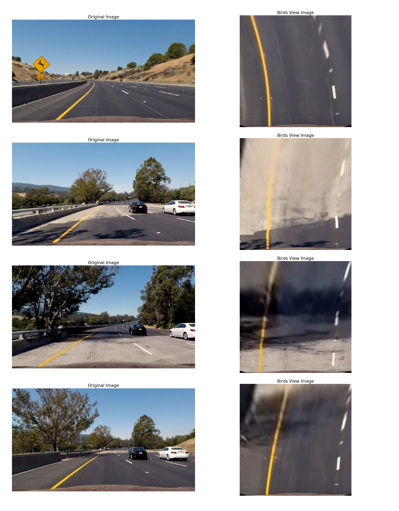
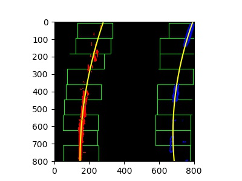

## Advanced Lane Finding Project

[](http://www.udacity.com/drive)

Overview - Udacity Self Driving Car Term 1 Project 3
----------------------------------------------------


The goals / steps of this project are the following:

* Compute the camera calibration matrix and distortion coefficients given a set of chessboard images.
* Apply a distortion correction to raw images.
* Apply a perspective transform to rectify image ("birds-eye view").
* Use color transforms, gradients, etc., to create a thresholded binary image.
* Detect lane pixels and fit to find the lane boundary.
* Determine the curvature of the lane and vehicle position with respect to center.
* Warp the detected lane boundaries back onto the original image.
* Output visual display of the lane boundaries and numerical estimation of lane curvature and vehicle position.


### Camera Calibration

Lenses create a distortion in the images they capture due to the fact that they are never perfectly curved (in theory the edge of a lens must have 0 width, now that is not really possible). This distortion can be corrected by software. 
The lens is used to shoot a chess board from multiple angles. Software can identify the vertices of the squares on the chess board and a mathematical model for correcting the specific lens (as a chess board has known properties) for the distortions it causes.

We use the opencv function `cv2.findChessboardCorners()` to find the 2d coordinates of multiple chessboards shot with the same lens. 
Associated with each picture we also store the coordinates of an ideal chessboard.
Later we use this data with `cv2.calibrateCamera()` to compute the camera calibration and distortion coefficients. This distortion correction can now be applied to any image with the `cv2.undistort()` function. 
On running it on an we get: 

The code can be found in `code/camera_calibration.py`


The calibration needs to be done only once. The results are save in `camera_ca/calibration.p` for further use.

### Distortion Corrected Image

To demonstrate this an image from the `test_images/` directory is loaded and distortion correction is applied on it in `test_calibration_on_road.py`.
The calibration details loads the Calibration Matrix and Distortion Coefficient for this camera from  `camera_ca/calibration.p` and undistorts the image by applying the `cv2.undistort()` function.
Here we see that the results are not as clearly appreciated as on a chess board image. Look closely at the white car on the right and the dashboard of the driving car, one can see distortion correction.
 


### Perspective Transform

In order to find landes effectively we transform the view from the dash cam to a birds eye view. 
This allows for better identification and fitting of the lines.

The key to getting a a good transform is the right identification of the vanishing point (where the train tracks would join) in the source image.
In `test_images/straight_lines1.jpg` we identify that the vanishing point is at 418px from the top.

Based on this we can use any isosceles trapezoid with its base centered at the bottom of the image and its sized converging to the vanishing point.

We use one which covers almost all of the cameras wide angle view as seen below:


Taking a wide view has an added advantage we can use this transform to restrict the region of interest in one pass.
The arithmetic in `code/detect.lanes.py` looks like

```
# arithmetic on the vanishing point to get the trapezoid points

vp_y = 418  # vp from top of image
indent_x = -30  # trapezoid base indent into image (negative value go outside)
delta = 40  # distance to trapezoid top from vp
t = vp_y + delta  # top pf trapezoid from top of image
s = ((640-indent_x)*delta) / (720-vp_y)  # length of trapezoid top / 2
src = np.float32([[640-s, t], [640+s, t], [1280-indent_x, 720], [indent_x, 720]])
```

We additionally accept information from the image from out side the trapezoid. 
40px from the left, 0 from top, 40 from the right and 0 from the bottom 
 
```
bird_view_size = (800, 800)  # Setup a 800x800 image to look at the birds view
offsets = [40, 0, 40, 0]  # offset to where the trapezoid vertices should be transformed to. positive values go into the image
```


We see that the transformation into birds views results in parallel road lines.
Transforming our set of trouble images into birds eye view would result in
 


We can see that the lanes are parallel and pretty clear at the bottom of the views (near the camera of car), looks good so far.


### Color Transforms and Thresholds

The goal is to identify lanes on the road. We use a combination of tow approaches. Image color tranforms and Sobel operator transformation to find near vertical edges (lanes are vertical)
In order to select the most useful transforms I tested various transforms out in `transform_selection_for_lane_detection.py`

Getting this step is key successfully identifying lines. After some tedious experimentation we used a yellow color mask a LAB B channel mask and a Sobel X Operation Mask (isolates verticle lines)
These are stacked on each other so that we get a combined signal from each source.

Images from each source are thresholded by values determined emperically thus the final signal from every pixel is wither a 0 or a 1 (in our case 255) 


### Polynomial Fit

The lane curves from the birds eye view are moderate, a 2nd degree polynomial is used to fit the signals into separate 2 lines.

First a point identifying the start of the lane line (one each for left and right) is chosen. This is done by taking at the sum of points in the y direction upto half the image and selecting the one with the highest magnitude.

```
histogram = np.sum(binary_warped[binary_warped.shape[0]//2:,:], axis=0)
...    
midpoint = np.int(histogram.shape[0]/2)
leftx_base = np.argmax(histogram[:midpoint])
rightx_base = np.argmax(histogram[midpoint:]) + midpoint
```
 


We use a sliding window approach where the image is split in to half vertically then a small window slide across each half looking for strong input singals

Each window starts above the lower one and then searches for the area where the signal is strongest (centroid)

These centroids are then fitted by a second degree curve.




### Vehicle Position in Lane

We know that road lane are 3.7 m apart, we also know the distance in px between between lanes in the warped image.
So every pixel's value can be computed in m.
If the camera_center > lane_center  then the vehicle and veered to the right. This is computed as function 
```
def distance_from_center(warped_width, warped_height, left_fit, right_fit):
    lc = lane_poly(warped_height, left_fit)
    rc = lane_poly(warped_height, right_fit)
    lane_center = (lc + rc) / 2
    camera_center = warped_width / 2
    lane_width = rc - lc
    # lane width = 3.7m
    return ((lane_center-camera_center)/lane_width) * 3.7, 'left' if lane_center > camera_center else 'right'
```

### Curvature of Lane at the Vehicle

A guide on radius of curvature http://www.intmath.com/applications-differentiation/8-radius-curvature.php

Fist we convert the left_fit and right_fit from warped space to undistorted space. 
The radius of curvature for a quadratic function is computed with the formula
( (1 + f'(y)^2)^3/2 ) / abs(2f''(y))

See the function `curvature_lr()` in `lane_marking_utils.py`   


### Result (video)

Here's a [link to the video result](./processed_project_video.mp4)

### Discussion

- The course and guide suggest that after distortion correction first the color and gradient transforms with thresholds should be applied to the images.
The goal is to find the lane lines so it is probably better to apply the perspective transform followed by the colorspace work.
This helps greatly in selecting weights, thresholds, kernels, hue numbers etc. As the result directly appears as a line / curve
- The key to solving this is finding the right image transforms. 
- We could use a smaller warped images and fewer sliding windows. The goal is to fit a 2nd degree curve. this would make the pipeline faster.      
- Smoothing can be applied between frames so that there is no abrupt change in lane values and mitigating lane detection drops.
- The lanes are parallel and 3.7m apart so that information can be used for correction
- Slopes can be handled if we can use an algorithm to find the horizon and use a dynamic perspective transform matrix. 
The code already allows us to change the location of the vanishing point
- GPS location with aerial photography could help with tricky areas of the road (massive slopes, bridges, sharp shadows etc)
- It would be interesting to see if this technique would would well at night. My guess is that it would do better
- It would also be very interesting to see how this plays out in the infra red spectrum. We know the lines are perceptibly cooler than tarmac
